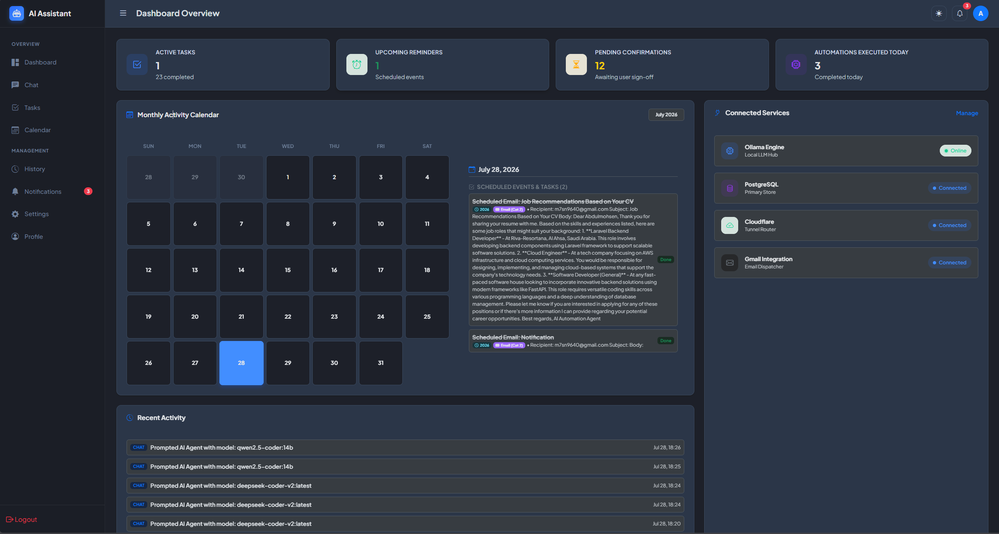
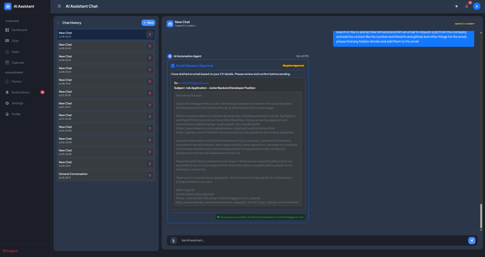
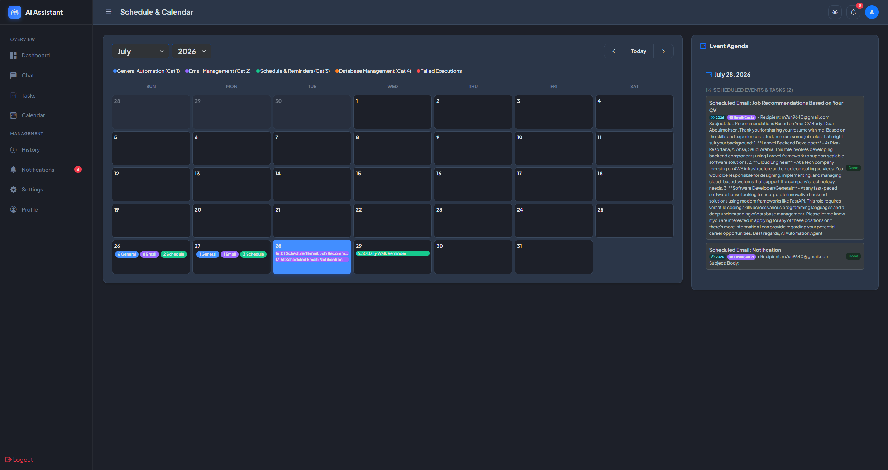

# AI Automation Assistant Platform

[](https://ai.m7snv2017.com)
[](https://ollama.ai/)

[](https://spring.io/projects/spring-boot)
[](https://www.docker.com/)

> **Try it Live**: Visit [https://ai.m7snv2017.com](https://ai.m7snv2017.com) to experience the AI Automation Assistant platform live in production.

---

## Platform Preview & Screenshots
### Dashboard

### Chat

### Calendar


---

## Key Stakeholders & Target Audience

- **Software Engineers & Developers**: Automated technical workflow execution, database task management, and document analysis.
- **Project Managers & Executives**: Scheduled recurring performance digests, activity tracking, and milestone email updates.
- **HR & Recruitment Teams**: Intelligent resume parsing, job role recommendation matching, and candidate communication.
- **System Administrators & DevOps**: On-premise private AI deployment (Ollama), Docker containerization, and environment isolation.

---

## Recommended Pages & Modules

- **Dashboard (`/dashboard`)**: Overview of active automations, real-time activity metrics, and quick action dispatchers.
- **AI Chat & Document Assistant (`/chat`)**: Action-driven conversational interface supporting PDF, Word, CSV, and JSON document analysis.
- **Visual Calendar & Agenda (`/calendar`)**: Color-coded category event calendar with threshold count badges and daily agendas.
- **Task & Automation Manager (`/tasks`)**: Task tracking with recurrence patterns, priority filters, and advance reminders.
- **Automation Execution History (`/history`)**: Audit logs and execution records for all AI actions and scheduled tasks.
- **User Profile (`/profile`)**: Manage personal account details, security credentials, and user preferences.
- **Platform Settings (`/settings`)**: Configuration for Gmail SMTP credentials, local Ollama AI model selection, and user profiles.

---

## Overview

**AI Automation Assistant** is a privacy-first, full-stack AI platform that integrates local LLM reasoning (via **Ollama** & `qwen2.5-coder:14b`) into a SaaS workflow automation suite. 

Instead of acting like a passive chatbot, the agent acts as an **Action Executive**—analyzing uploaded documents (PDFs, Word `.docx`, CSVs, JSON), recommending career matches or workflow tasks, drafting personalized emails, and scheduling calendar events with one-click confirmation cards.

---

## Key Features

- **Action-Driven AI Agent**: Automatically drafts emails, generates categorized task lists, and proposes calendar events via interactive confirmation cards.
- **Advanced Document Extraction**:
  - **PDF Decompression**: In-memory ZLIB Inflater stream extraction.
  - **Word Archive Parsing**: Direct `ZipInputStream` extraction of `word/document.xml`.
- **Smart Threshold Calendar**:
  - Color-coded categories: **General Automation** (Blue), **Email Management** (Purple), **Schedule & Reminders** (Green), **Database Management** (Orange), **Failed Executions** (Red).
  - Dynamic display: Render individual event pills ($\le 3$ daily events) or compact category count badges ($> 3$ daily events).
- **Automated Email Dispatch**: Integrates with Gmail SMTP to dispatch automated reports, task notifications, and scheduled emails.
- **Containerized Architecture**: Production-ready Docker Compose environment linking Spring Boot 3.3 (Java 21 JRE) and PostgreSQL 16 Alpine.

---

## Technology Stack

| Layer | Technology |
|---|---|
| **Backend** | Java 21, Spring Boot 3.3.5, Spring Security, Spring Data JPA |
| **Frontend** | HTML5, Modern Vanilla CSS, JavaScript (ES6+), Bootstrap 5.3, Thymeleaf |
| **AI / LLM** | Ollama (`qwen2.5-coder:14b` / `deepseek-coder-v2`) with 16k context window |
| **Database** | PostgreSQL 16 Alpine / H2 In-Memory |
| **DevOps** | Docker, Docker Compose, Cloudflare Tunnels |

---

## Quick Start & Setup

### Prerequisites
- [Docker & Docker Compose](https://www.docker.com/) installed.
- [Ollama](https://ollama.ai/) running locally (`ollama run qwen2.5-coder:14b`).

### Build & Launch Containers
```bash
docker compose up --build -d
```

### Access Application
Open your browser and navigate to:
- **Local Application**: `http://localhost:8080`
- **Live Production URL**: [https://ai.m7snv2017.com](https://ai.m7snv2017.com)

---

## Security & Privacy

- **Local LLM Execution**: AI processing is executed on-premise/locally via Ollama, keeping sensitive documents and CV data private.
- **Environment Isolation**: Database credentials and SMTP secrets are strictly managed via environment variables.

---

## Contact & Live Access

To test the platform directly in your browser, visit the live endpoint:
**[https://ai.m7snv2017.com](https://ai.m7snv2017.com)**
